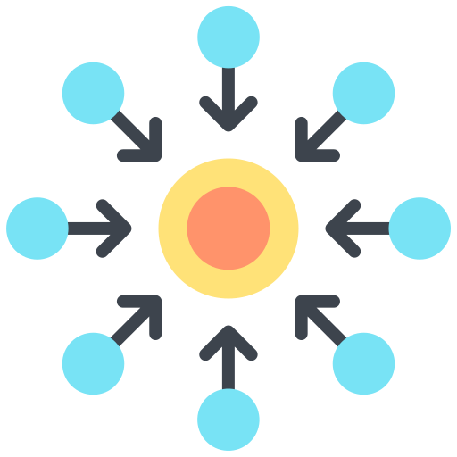

    

<h1 align="center">Nexus</h1>

Nexus is a next-generation anti-cheat solution for Minecraft servers. It is designed to be
a full replacement for other anti-cheat, anti-spoof, and anti-exploit plugins, while bringing
new and exciting features to the table.

## Features

- Client Detection - Nexus can detect a wide range of clients (e.g. Fabric/Forge)
- Cheat Detection - Cheat detection using the most recent and up-to-date methods
- Anti-Spoof - Nexus can detect spoofed usernames and UUIDs
- Anti-Exploit - Nexus can detect exploits such as X-Ray and AutoClicker

## How is Nexus different?

First of all, Nexus is an all-in-one solution. While current solutions require server admins
to buy and install multiple plugins to cover all the bases, Nexus is designed to be a
one-stop shop. With this mindset, Nexus allows itself to be more flexible than other solutions. Nexus
is designed to be modular, allowing server admins to enable and disable features as they
see fit. 

Furthermore, Nexus uses a unique approach to cheat detection. Instead of using traditional
cheat detection methods, Nexus uses a combination of machine learning and traditional
methods to detect cheats. This allows Nexus to be more accurate and more efficient than
other solutions. The different built-in operating modes allow server admins to choose
how Nexus should operate, allowing for more optimized performance when needed.

## Open Source

Nexus is open source, meaning that anyone can view the source code and contribute to the
project. This allows for more transparency and allows the community to help improve the
project. The following is a list of items that are currently not open source:

- Machine Learning Models
- Configuration Files
- Database Files

This is to ensure the integrity of the models and the security of the configuration. It 
also prevents from blatant stealing of the models and configuration files.

---

<h5 align="center">Icons provided by <a href="https://www.flaticon.com/">Flaticon</a></h5>